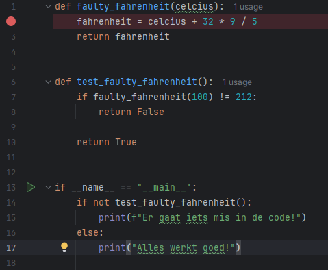
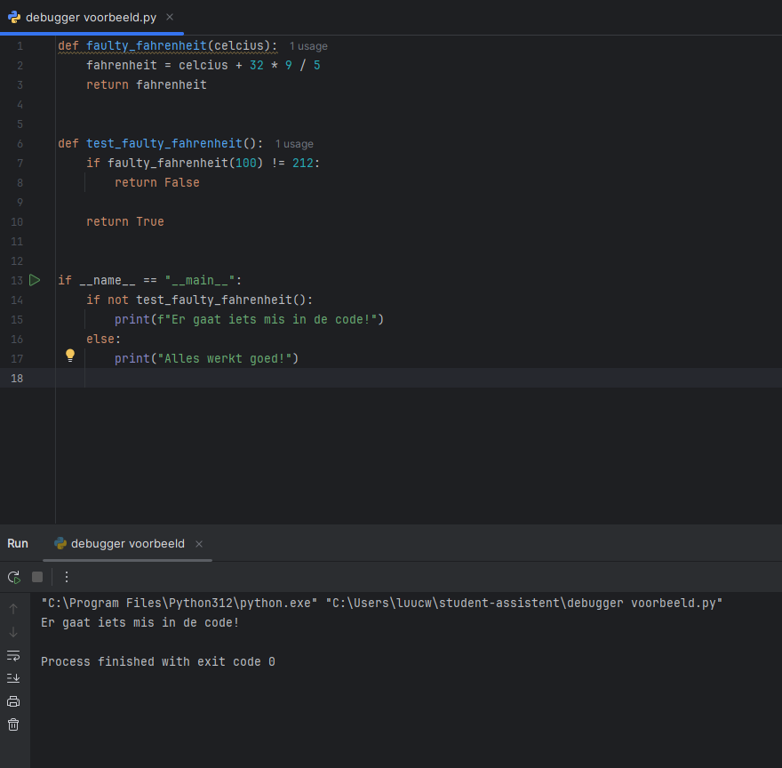
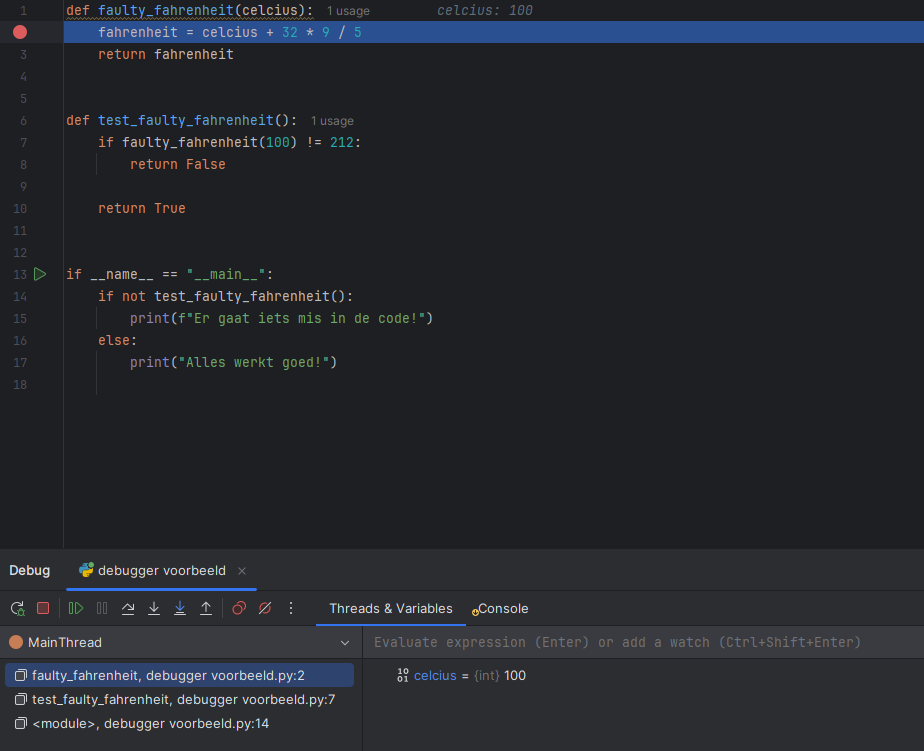
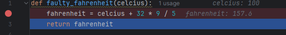

# De debugger in PyCharm

Om goed te kunnen weten wat er gebeurt in je code, is het vaak handig om een debugger te gebruiken.

Je kan met de PyCharm debugger stap voor stap door je code heen gaan, super handig! 

Maar hoe gebruiken we die debugger nou eigenlijk?

## Breakpoints

Een breakpoint is een punt in je code waar de debugger als het ware stopt. 

Je kan een breakpoint zetten aan de linkerkant van je code, door op de grijze balk te klikken.

Dat ziet er dan ongeveer zo uit: 

## Debuggen

We hebben nu een breakpoint gezet, maar daar heb je an sich nog niet zo gek veel aan. 

Laten wij mijn code eens runnen, en zien wat er gebeurt.

Oei, de ingebouwde test zegt dat er iets fout gaat! Laten we eens kijken wat ik fout heb gedaan:

We zetten een breakpoint in de functie, en runnen de code in debug mode:

Laten we eens kijken wat de functie nou eigenlijk returnt...

We gaan stap voor stap door de code heen, (dit doen we door op het knopje naast de pauzeknop te klikken in het debug menu, dit is een gebogen pijltje naar rechts)

En dan zien we op een gegeven moment de waarde die aan de variabele fahrenheit wordt gegeven:

Aha! We returnen met de functie faulty_fahrenheit 157.6 graden als we 100 celcius invoeren. Dat is natuurlijk niet goed!

We zouden eigenlijk 212 graden moeten returnen, vandaar de error!

## Slot

Zoals je ziet is de debugger een super handige tool om je code te debuggen als je niet weet wat er fout gaat, dit is natuurlijk een heel simpel voorbeeld, maar zeker als je code complexer wordt is het handig om de debugger te gebruiken!

**Happy debugging!**

